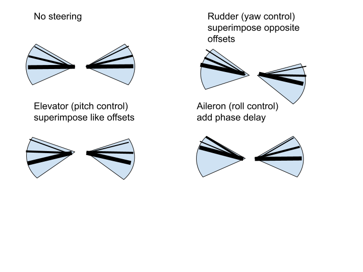

# YUAA Ornithopter Project

An ornithopter is a flying machine that generates thrust and lift by imitating the flight of birds. Ornithopters have the advantages of maneuverability, versatility, and stealth over traditional aircraft, making them useful in aerial reconnaissance, search & rescue, and agricultural surveying. In this project, we design and build an ornithopter capable of sustained flight and maneuvering.

# Software

## Controls

Our ornithopter is highly customizable, with many adjustable variables to cater to various flying styles. Such include:

 - **maxFrequency**: Maximum flapping frequency reached when throttle is pulled all the way up. The higher the value, the faster the wings flap, and the more sensitive the flapping frequency will be.
 - **zeroThrottleAngle**: Our ornithopter glides when the throttle is set to 0, or a range close to 0 denoted by **deadZone**. This variable adjusts the angle (in degrees) above the horizontal the wing rests at in glide mode.
 - **levelAngle**: Angle above the horizontal at center of flapping cycle.
 - **maxAmplitude**: How far above and below **levelAngle** the wing flaps.
 - **maxRollPhaseShift**: Roll is achieved by adding a phase delay to the wing opposite to the side of which you want to turn. This variable defines the maximum phase shift when the magnitude of the roll control is at its maximum.
 - **maxPitchAngle**: Pitch is elevated by raising the **levelAngle** and lowered by decreasing it. This variable denotes the maximum change to **levelAngle** when pitch is set to its maximum magnitude. The higher this is, the more sensitive the pitch control.
 - **maxYawAngle**: Yaw is achieved by lowering the **levelAngle** on the side you yaw towards and raising it on the opposite side. This variable defines the maximum deviation to **levelAngle** when yaw is set to its maximum magnitude. The higher this is, the more sensitive the yaw control.
 - **deadZone**: For every control, there is a range in which the value is interpreted as 0. This allows for gliding and makes it easy to keep a purely level angle. The higher this value is, the larger that dead zone.
 - **delayTime**: Frequency at which a new control is registered and a new servo output is generated. The lower this is, the smoother the controls.

All other parameters should be left unmodified.

## Behind the Scenes

The remote controller has 8 channels, each mapped to a control (roll, pitch, yaw, etc.). For each of the controls, we normalize the digital input to a value between 0 and 1 or -1 and 1. There are three control modes&mdashnormal, amp, and basic&mdashthat reconfigure the layout of the controls. Every iteration of the event loop, we input the controls into a function called **updatePosition()**, which renders new servo positions corresponding to the positions in the flap cycle. **updatePosition()** is a void function, meaning it directly updates the global variables instead of returning an output. The function relies on a unit circle methodology, where the wing position is the *sin* of a rotating point around a circle, and the linear velocity of the rotating point is determined by the throttle. The other controls module the angle and phase.

